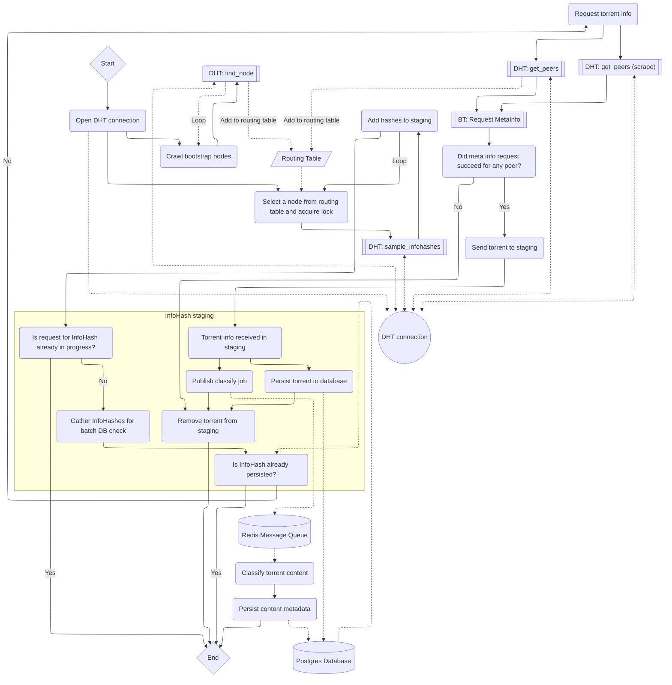

# Architecture & Lifecycle of the DHT Crawler

The DHT and BitTorrent protocols are (rather impenetrably) documented at [bittorrent.org](http://bittorrent.org/beps/bep_0000.html){:target="\_blank"}. Relevant resources include:

- [BEP 5: DHT Protocol](http://bittorrent.org/beps/bep_0005.html){:target="\_blank"}
- [BEP 51: Infohash Indexing](https://www.bittorrent.org/beps/bep_0051.html){:target="\_blank"}
- [BEP 33: DHT Scrapes](https://www.bittorrent.org/beps/bep_0033.html){:target="\_blank"}
- [BEP 10: Extension Protocol](https://www.bittorrent.org/beps/bep_0010.html){:target="\_blank"}
- [The Kademlia paper](https://pdos.csail.mit.edu/~petar/papers/maymounkov-kademlia-lncs.pdf){:target="\_blank"}

The rest of what I've figured out about how to implement a DHT crawler was cobbled together from [the now archived **magnetico** project](https://github.com/boramalper/magnetico){:target="\_blank"} and [anacrolix's BitTorrent libraries](https://github.com/anacrolix){:target="\_blank"}.

The following diagram illustrates roughly how the crawler has been implemented within **bitmagnet**. It's debatable if this will help stop anyone's brain from melting, including my own.

{: .warning-title }

> Todo
>
> This diagram is out-of-date and needs updating to reflect the new DHT crawler design.

[comment]: <> (Need to enable panning and zooming for this ridiculous diagram, let the hacking commence!)
[comment]: <> (panzoom comes from https://github.com/timmywil/panzoom)

